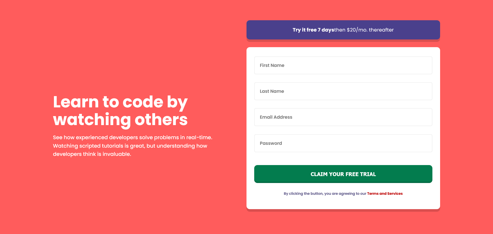

# Frontend Mentor - Intro component with sign up form solution

This is a solution to the [Intro component with sign up form challenge on Frontend Mentor](https://www.frontendmentor.io/challenges/intro-component-with-signup-form-5cf91bd49edda32581d28fd1). Frontend Mentor challenges help you improve your coding skills by building realistic projects. 

## Table of contents

- [Overview](#overview)
  - [The challenge](#the-challenge)
  - [Screenshot](#screenshot)
  - [Links](#links)
- [My process](#my-process)
  - [Built with](#built-with)
  - [What I learned](#what-i-learned)
  - [Continued development](#continued-development)
  - [Useful resources](#useful-resources)
- [Author](#author)
- [Acknowledgments](#acknowledgments)

**Note: Delete this note and update the table of contents based on what sections you keep.**

## Overview

### The challenge

Users should be able to:

- View the optimal layout for the site depending on their device's screen size
- See hover states for all interactive elements on the page
- Receive an error message when the `form` is submitted if:
  - Any `input` field is empty. The message for this error should say *"[Field Name] cannot be empty"*
  - The email address is not formatted correctly (i.e. a correct email address should have this structure: `name@host.tld`). The message for this error should say *"Looks like this is not an email"*

### Screenshot



### Links

- Solution URL: [Add solution URL here](https://www.frontendmentor.io/solutions/intro-rJGSVL5f9)
- Live Site URL: [Add live site URL here](https://introqstar.netlify.app/?username=&username2=&email=&password=)

## My process

### Built with

- Semantic HTML5 markup
- CSS custom properties
- Flexbox
- CSS Grid
- Mobile-first workflow
- [Styled Components](https://styled-components.com/) - For styles

**Note: These are just examples. Delete this note and replace the list above with your own choices**

### What I learned

I learned a lot about color contrast and accessibility


```//Condition for errors
const setError = (element, message) => {
    const inputControl = element.parentElement;
    const errorDisplay = inputControl.querySelector('.error');

    //The message
    errorDisplay.innertext = message;
    inputControl.classList.add('error');
}

const setSuccess = element => {
    const inputControl = element.parentElement;
    const errordisplay = inputControl.querySelector('.error');

    //Remove the error you message and class!!!!!
    errordisplay.innerText = '';
    inputControl.classList.add('success');
    inputControl.classList.remove('error');
}
const isValidEmail = email => {
    const re = /^(([^<>()[\]\\.,;:\s@"]+(\.[^<>()[\]\\.,;:\s@"]+)*)|(".+"))@((\[[0-9]{1,3}\.[0-9]{1,3}\.[0-9]{1,3}\.[0-9]{1,3}\])|(([a-zA-Z\-0-9]+\.)+[a-zA-Z]{2,}))$/;
    return re.test(String(email).toLowerCase());
}


const validateInputs = () => {
    const usernameValue = username.value.trim();
    const username2Value = username2.value.trim();
    const emailValue = email.value.trim();
    const passwordValue = password.value.trim();

    if(usernameValue === '') {
        setError(username, 'First name cannot be empty');
    }else{
        setSuccess(username);
    }

    if(username2Value === '') {
        setError(username2, 'Last name cannot be empty');
    }else {
        setSuccess(username2);
    }

    if(emailValue === '') {
        setError(email, 'Please provide an email');
    }else if(!isValidEmail(emailValue)) {
        setError(email, 'Looks like this is not an email')
    }else {
        setSuccess(email);
    }

    if(passwordValue === '') {
        setError(password, 'Password cannot be empty');
    }else if (passwordValue.length < 8) {
        setError(password, 'Password must be at least 8 chracters.')
    }else {
        setSuccess(password);
    }
    
};
```


### Continued development

I want to collab on bigger projects if you would like to collab reach out.🦾 

**Note: Delete this note and the content within this section and replace with your own plans for continued development.**

### Useful resources

- [Example resource 1](https://www.example.com) - This helped me for XYZ reason. I really liked this pattern and will use it going forward.
- [Example resource 2](https://www.example.com) - This is an amazing article which helped me finally understand XYZ. I'd recommend it to anyone still learning this concept.


## Author

- Website - [Amario Jones](https://introqstar.netlify.app/?username=&username2=&email=&password=)
- Frontend Mentor - [@Qstar12](https://www.frontendmentor.io/profile/Qstar12)
- Twitter - [@AmarioJones1](https://twitter.com/AmarioJones1)


## Acknowledgments

Thanks for viewing!
